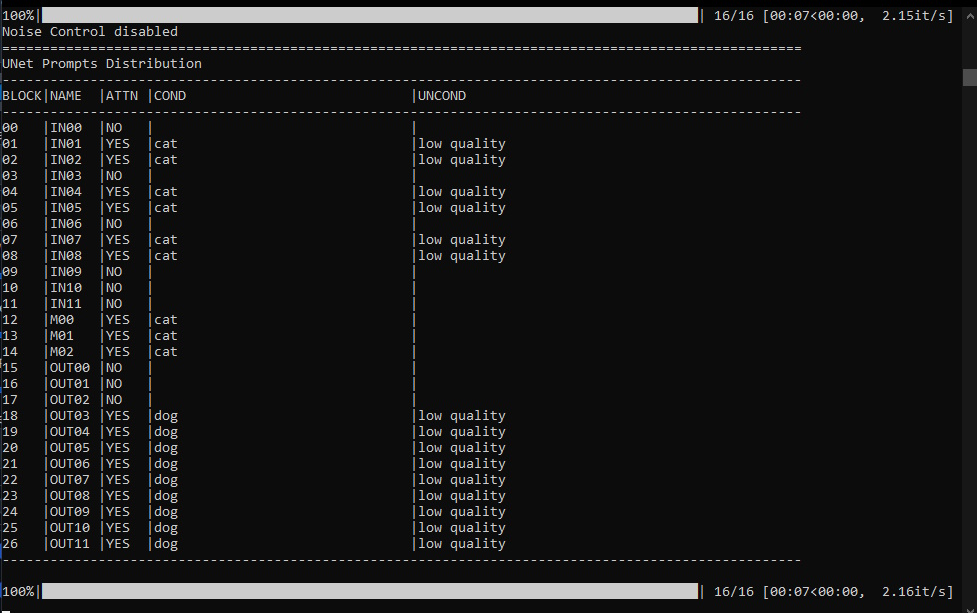
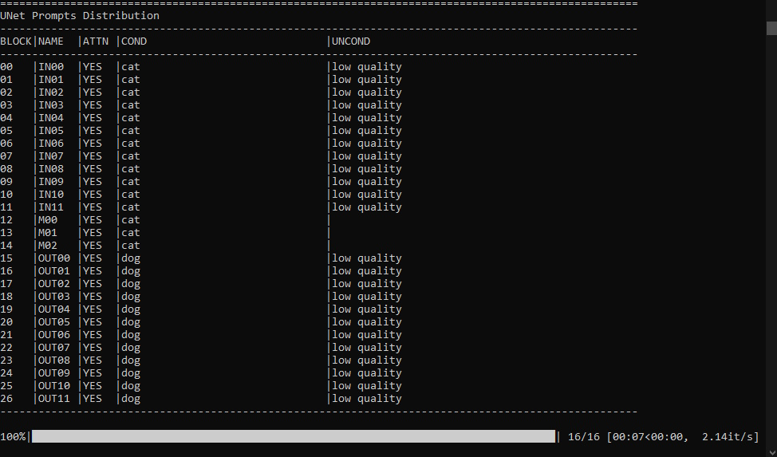

# UNet Control for Webui/SD15

This project provides an advanced tool to write negative and positive prompts directly to the UNet blocks with a flexible syntax.

## Features

- UNet mode selection:
  - `unet` : standard unet plage - open just the attn block.
  - `free` : personal structure - all unet block are open to write.
- Advanced syntax for assigning text to UNet blocks
- Unet distribution show in console

## Block Syntax

The syntax allows assigning text to specific UNet blocks.
NOTE: The unet has 3 middles blocks called M00, M01, M02. The are important blocks. 
If you forgot to write to M00 like &M00="Text", generaly the unet will stop follow your prompt.
Technically it seem recommanded to write to these three blocks despite juste the M01 has the attn flag.
This follow the same syntax used for other block: &M00-M02="text".


### Single Column

| Type     | Example          | Description                            |
|----------|------------------|----------------------------------------|
| Unique   | `&I00="text"`    | Assigns text to block I00              |
| Multiple | `&I00:05="text"` | Assigns text to blocks I00 through I05 |
| Range    | `&I00-I05="text"`| Same as Multiple                       |

### Double Columns

| Type     | Example                       | Description                                        |
|----------|-------------------------------|----------------------------------------------------|
| Unique   | `&I00:&O05="text"`            | Text applied from block I00 and block O05           |
| Multiple | `&I00:05&O01:04:05:06="text"` | Assigns text to multiple blocks in I and O columns |

### Extended (Two Columns)

| Type   | Example           | Description                              |
|--------|-----------------|--------------------------------------------|
| Unique | `&I00:05+="text"` | Adds text to blocks I00 through I05      |
| Range  | `&I00-05+="text"` | Same principle with a block range        |


### Example 

```
Prompt: &I00-11="cat" &O00-11="dog" &M00-02="cat"
Negative prompt: &I00-11+="low quality"
```
Console result:

Mode: unet


Mode: free



